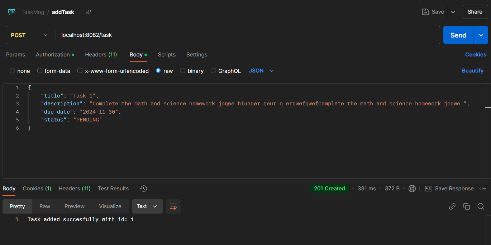
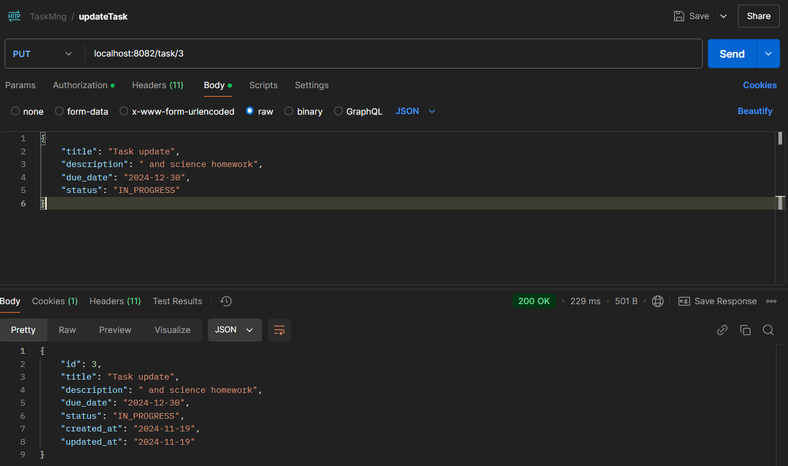

Task Management Application Documentation
Overview

All endpoints except /task/home are secured. Use basic authentication:

    Username: user
    Password: pass

This is a Spring Boot application for managing tasks. 
It uses an in-memory H2 database that mimics MySQL and includes basic authentication with username="user" and password="pass". 
The application supports CRUD operations on tasks via RESTful endpoints.
How to Run the Application
Database Schema

 Each task :

 - id (unique identifier)

 - title (string)

 - description (string)

 - due_date (date)

 - status (enum: "pending", "in_progress", "completed")

 - created_at (timestamp)

 - updated_at (timestamp)

 Implement the following API endpoints:

 - GET /tasks: Retrieve all tasks

 - GET /tasks/{id}: Retrieve a specific task by ID

 - POST /tasks: Create a new task

 - PUT /tasks/{id}: Update an existing task

 - DELETE /tasks/{id}: Delete a task

 - PATCH /tasks/{id}/complete: Mark a task as complete

Testing the Application
1. Authentication
2. 

You can test endpoints using Postman, cURL, or a similar tool.
2. REST Endpoints

1. Get All Tasks

   Endpoint: GET /tasks
   Description: Retrieves a list of all tasks.
   Example Request:

   curl -u user:pass -X GET http://localhost:8082/tasks

2. Get Task by ID

   Endpoint: GET /tasks/{id}
   Description: Retrieves a specific task by ID.
   Example Request:

   curl -u user:pass -X GET http://localhost:8082/tasks/1

3. Create a Task

   Endpoint: POST /tasks
   Description: Creates a new task.
   Example Request:

   curl -u user:pass -X POST http://localhost:8082/tasks \
   -H "Content-Type: application/json" \
   -d '{
"title": "New Task",
"description": "Description of task",
"due_date": "2024-11-30"}'
   

4. Update a Task

   Endpoint: PUT /tasks/{id}
   Description: Updates an existing task.
   Example Request:
 

   curl -u user:pass -X PUT http://localhost:8082/tasks/1 \
   -H "Content-Type: application/json" \
   -d '{"title": "Updated Task", "description": "Updated description", "due_date": "2024-12-05"}'

5. Delete a Task

   Endpoint: DELETE /tasks/{id}
   Description: Deletes a task.
   Example Request:

   curl -u user:pass -X DELETE http://localhost:8082/tasks/1

6. Mark a Task as Complete

   Endpoint: PATCH /tasks/{id}/complete
   Description: Marks a task as complete.
   Example Request:

   curl -u user:pass -X PATCH http://localhost:8082/tasks/1/complete

3. Testing
  Use run mvn test

To ensure the application is functioning as expected:

    Run unit tests with Maven:

    mvn test

Common Issues

    H2 Console Not Accessible:
        Ensure the application is running.
        Verify the URL http://localhost:8082/h2-console.

    Authentication Fails:
        Ensure you are using the correct credentials: user:pass.

Future Enhancements

    Switch to MySQL for production.
    Add JWT-based authentication.
    Implement pagination for retrieving tasks.
